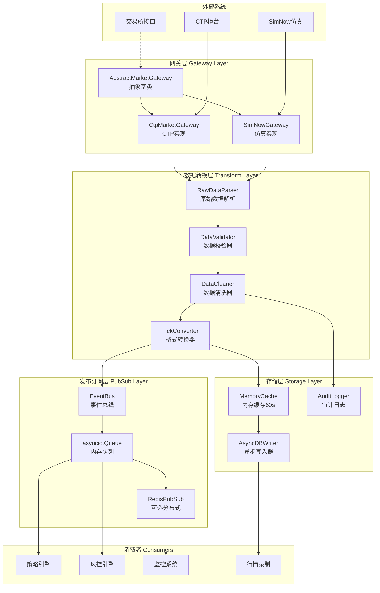
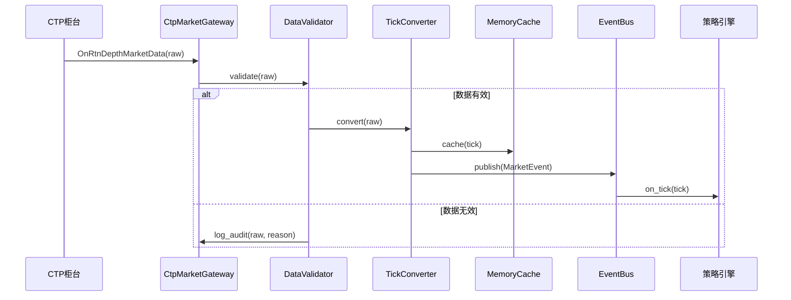
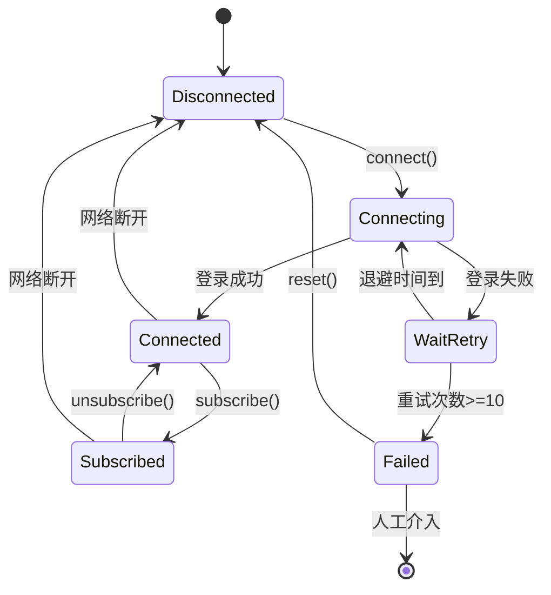
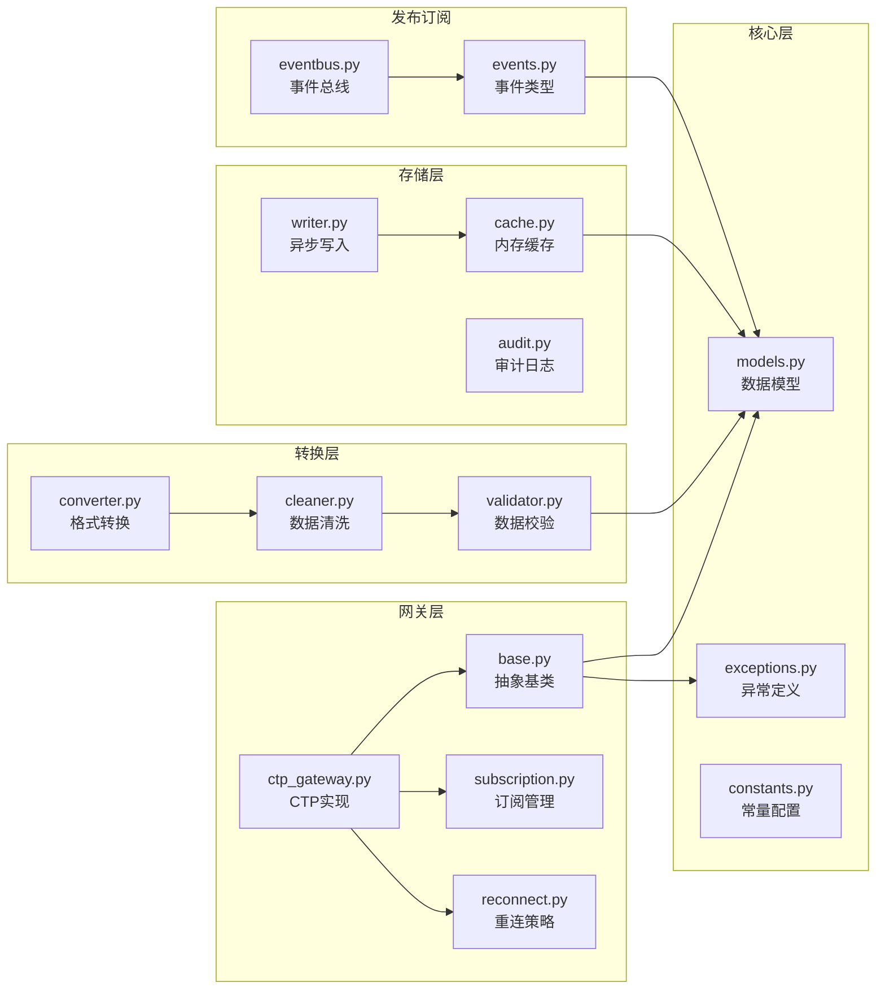

# 行情网关模块架构设计

## 1. 系统架构图

## 2. 数据流时序图

## 3. 断线重连状态机

## 4. 核心类职责（单一职责原则）

| 类名 | 职责 | 依赖 |
|------|------|------|
| `AbstractMarketGateway` | 定义网关抽象接口，生命周期管理 | - |
| `CtpMarketGateway` | CTP协议具体实现，回调处理 | pyctp, AbstractMarketGateway |
| `GatewayConfig` | 网关配置模型（服务器、账户、超时） | pydantic |
| `TickData` | 标准化行情数据模型 | pydantic |
| `DepthData` | 深度行情数据模型（5档） | pydantic |
| `DataValidator` | 数据有效性校验（价格、量、时间） | - |
| `DataCleaner` | 数据清洗与标准化 | DataValidator |
| `SubscriptionManager` | 订阅列表管理（幂等、上限控制） | - |
| `ReconnectPolicy` | 重连策略（指数退避、次数限制） | - |
| `EventBus` | 事件发布订阅（asyncio.Queue） | asyncio |
| `MemoryCache` | 内存缓存（LRU, 60s TTL） | - |
| `AsyncDBWriter` | 异步数据库写入（批量、重试） | asyncio, asyncpg |
| `AuditLogger` | 审计日志（脏数据、异常事件） | structlog |

## 5. 模块依赖关系

